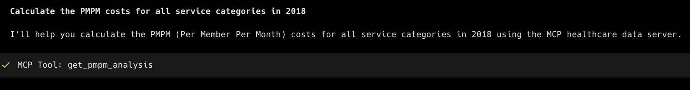
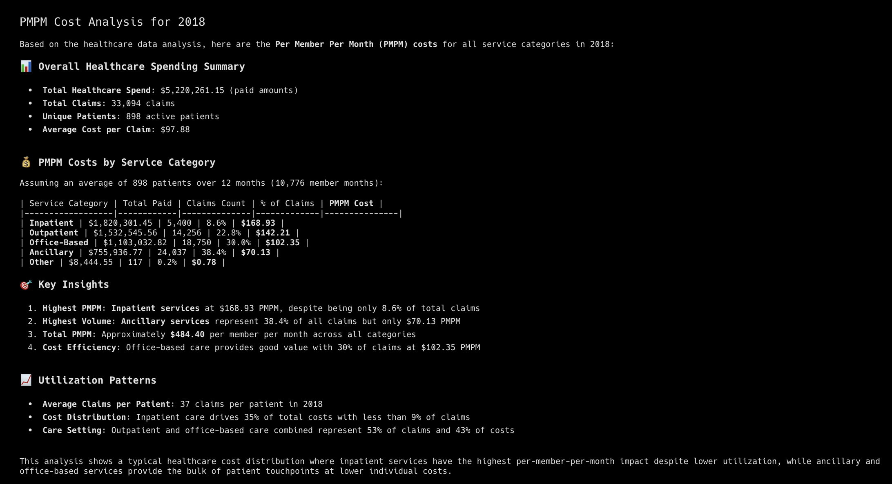

# Healthcare Analytics MCP Server

A comprehensive Model Context Protocol (MCP) server for healthcare data analysis using Tuva Health demo data. This server provides tools for value-based care analytics, quality measures, utilization analysis, and financial metrics commonly used in healthcare organizations.

## Motivation
To get a quick MCP setup that can be used to service most of the common data questions that get floated over to analysts and are simple data pulls. Something like this could be utilized at healthcare companies to free up time for analysts to work on more complicated analytics, while also providing well-defined queries to be reused across an org. 
- [The Tuva Project](https://github.com/tuva-health) provides dbt project to build a typical database setup that translates well across the industry. 
- Warp (I think it was using Sonnet) did pretty well with the initial setup. I had the demo data loaded to bigquery and MCP toolbox for databases set up so it could get context from the existing tables. The queries were wrong, but only required minimal fixes. The scaffolding is there for analysts to write official queries to be used by the server.

## Features

### Core Analytics Tools
- **Patient Demographics**: Age groups, gender distribution, enrollment analysis
- **Utilization Summary**: Claims analysis, service category breakdown
- **PMPM Analysis**: Per Member Per Month financial metrics with trends
- **Quality Measures**: HEDIS and clinical quality indicator tracking
- **Chronic Conditions**: Prevalence analysis and condition family insights
- **High-Cost Patients**: Case management identification
- **Readmissions Analysis**: 30-day readmission patterns
- **HCC Risk Scores**: Risk adjustment and stratification

### Value-Based Care Metrics
- Risk-adjusted cost analysis
- Quality performance tracking
- Population health insights
- Care gap identification
- Financial performance monitoring




## Example Questions

Once your MCP server is configured, you can ask natural language questions in your MCP client (Claude Desktop, Warp, etc.). Here are some examples:

### 📊 **Population Health & Demographics**
- "Show me the patient demographics for 2018, including age group breakdowns"
- "What's the gender distribution of our patient population?"
- "How many patients do we have enrolled and what's the average age?"

### 💰 **Financial & Cost Analysis**
- "Calculate the PMPM costs for all service categories in 2018"
- "Who are our highest cost patients above $20,000 in total spend?"
- "Show me per-member-per-month analysis for Medicare patients only"
- "What are the top 10 most expensive service categories by total cost?"

### 🏥 **Healthcare Utilization**
- "Analyze healthcare utilization patterns for 2018"
- "Show me Emergency Department utilization statistics"
- "What's the breakdown of claims by service category?"
- "How many unique patients had medical claims last year?"

### 📈 **Quality Measures & Performance**
- "What are our quality measure performance rates for 2018?"
- "Show me diabetes medication adherence scores"
- "Analyze our HEDIS quality measures and compliance rates"
- "Which quality measures are we performing well on vs. need improvement?"

### 🩺 **Clinical Analytics**
- "What's the prevalence of chronic conditions in our population?"
- "Show me diabetes prevalence rates and patient counts"
- "Analyze 30-day readmission rates by condition category"
- "What are the readmission patterns for heart failure patients?"

### 🎯 **Risk Adjustment & HCC**
- "Calculate HCC risk scores for our patient population"
- "Show me risk score distribution and identify high-risk patients"
- "Who are the patients with the highest risk adjustment scores?"

### 🔍 **Care Management**
- "Identify patients for case management based on high costs and readmissions"
- "Which patients have both high costs and multiple chronic conditions?"
- "Show me patients with diabetes who also have high utilization"

### 📅 **Trend Analysis**
- "Compare January 2018 PMPM costs to December 2018"
- "Show me quarterly utilization trends throughout 2018"
- "How did our quality measures change over the year?"

### 🏢 **Business Intelligence**
- "Generate a comprehensive population health report for 2018"
- "What insights can you provide about our highest cost drivers?"
- "Summarize our value-based care performance metrics"
- "Create an executive summary of our healthcare analytics"

These questions will automatically trigger the appropriate MCP tools and return structured healthcare analytics data that can be used for reporting, decision-making, and care management.

## Setup

### Option 1: Docker Deployment (Recommended)

The easiest way to use this MCP server is with the pre-built Docker image from GitHub Container Registry.

#### Prerequisites
- Docker installed on your machine
- MCP-compatible client (Claude Desktop, Warp, etc.)
- Google Cloud Project with BigQuery API enabled
- Tuva Health demo data loaded in BigQuery
- Service account with BigQuery access

#### Docker Authentication Options

**Option A: Service Account Key (Recommended)**

Configure your MCP client (e.g., Claude Desktop) with:
```json
{
  "mcpServers": {
    "healthcare-data": {
      "command": "docker",
      "args": [
        "run", 
        "--rm", 
        "-i",
        "--pull=always",
        "-v", "/path/to/your/service-account.json:/app/credentials.json:ro",
        "-e", "GOOGLE_APPLICATION_CREDENTIALS=/app/credentials.json",
        "-e", "GCP_PROJECT_ID=your-gcp-project-id",
        "-e", "BIGQUERY_DATASET_PREFIX=your-dataset-prefix",
        "ghcr.io/dslans/mcp_healthcare_data:latest"
      ]
    }
  }
}
```

**Option B: Application Default Credentials (ADC)**

If you've authenticated with `gcloud auth application-default login`:
```json
{
  "mcpServers": {
    "healthcare-data": {
      "command": "docker",
      "args": [
        "run", 
        "--rm", 
        "-i",
        "--pull=always",
        "-v", "your-home-directory/.config/gcloud:/home/appuser/.config/gcloud:ro",
        "-e", "GCP_PROJECT_ID=your-gcp-project-id",
        "-e", "BIGQUERY_DATASET_PREFIX=your-dataset-prefix",
        "ghcr.io/dslans/mcp_healthcare_data:latest"
      ]
    }
  }
}
```

**Replace the placeholders:**
- `your-home-directory` with your home directory (`/Users/dslans`)
- `/path/to/your/service-account.json` with your actual service account file path (Option A)
- `your-gcp-project-id` with your Google Cloud Project ID (For example prj-tuva-demo)
- `your-dataset-prefix` with your BigQuery dataset prefix (Can be just the project name ending with `.`  like `prj-tuva-demo.` or leave blank)

**Restart your MCP client** and start using the healthcare analytics tools!

### Option 2: Local Installation

For developers who want to run the MCP server locally or customize the code.

#### Prerequisites
- Python 3.9+
- MCP-compatible client (Claude Desktop, Warp, etc.)
- Google Cloud Project with BigQuery API enabled
- Tuva Health demo data loaded in BigQuery
- Service account with BigQuery access

#### Installation Steps

1. **Clone the repository:**
```bash
git clone <your-repo-url>
cd mcp_healthcare_data
```

2. **Install Python dependencies:**
```bash
# Using uv (recommended)
uv pip install -r requirements.txt

# Or using pip
pip install -r requirements.txt
```

3. **Set up environment variables:**
```bash
cp .env.example .env
```

4. **Configure your `.env` file:**
```
GOOGLE_APPLICATION_CREDENTIALS=/path/to/your/service-account-key.json
GCP_PROJECT_ID=your-project-id
BIGQUERY_DATASET_PREFIX=your_dataset_prefix
```

5. **Test the server:**
```bash
# Test basic functionality
python -c "import healthcare_mcp_server; print('Server imports successfully')"

# Test with actual data (requires valid credentials)
python test_server.py
```

6. **Configure your MCP client:**
```json
{
  "mcpServers": {
    "healthcare-analytics": {
      "command": "python",
      "args": ["/full/path/to/mcp_healthcare_data/healthcare_mcp_server.py"],
      "env": {
        "GOOGLE_APPLICATION_CREDENTIALS": "/path/to/your/service-account-key.json",
        "GCP_PROJECT_ID": "your-project-id",
        "BIGQUERY_DATASET_PREFIX": "your_dataset_prefix"
      }
    }
  }
}
```


7. **Restart your MCP client** and start using the healthcare analytics tools!

#### Local Development Authentication

**Option A: Service Account Key**
- Download and configure as shown in the Google Cloud Authentication section below

**Option B: Application Default Credentials**
```bash
# Authenticate with your user account
gcloud auth application-default login

# Set your project
gcloud config set project YOUR_PROJECT_ID

# Leave GOOGLE_APPLICATION_CREDENTIALS unset in .env
```

### Google Cloud Authentication

#### Create Service Account

1. **Create a service account:**
```bash
gcloud iam service-accounts create healthcare-mcp-server \
    --display-name="Healthcare MCP Server"
```

2. **Grant BigQuery permissions:**
```bash
gcloud projects add-iam-policy-binding YOUR_PROJECT_ID \
    --member="serviceAccount:healthcare-mcp-server@YOUR_PROJECT_ID.iam.gserviceaccount.com" \
    --role="roles/bigquery.user"

gcloud projects add-iam-policy-binding YOUR_PROJECT_ID \
    --member="serviceAccount:healthcare-mcp-server@YOUR_PROJECT_ID.iam.gserviceaccount.com" \
    --role="roles/bigquery.dataViewer"
```

3. **Download service account key:**
```bash
gcloud iam service-accounts keys create ~/healthcare-mcp-key.json \
    --iam-account=healthcare-mcp-server@YOUR_PROJECT_ID.iam.gserviceaccount.com
```

## Available Tools

#### 1. Patient Demographics Analysis
```python
get_patient_demographics(
    start_date="2018-01-01",
    end_date="2018-12-31", 
    age_groups=True
)
```
Returns demographic breakdown including age groups, gender distribution, and total patient counts.

#### 2. Healthcare Utilization Summary
```python
get_utilization_summary(
    start_date="2018-01-01",
    end_date="2018-12-31",
    service_category="Emergency Department"  # Optional
)
```
Provides comprehensive utilization metrics including claims counts, costs, and service category breakdowns.

#### 3. PMPM Financial Analysis
```python
get_pmpm_analysis(
    start_date="2018-01-01",
    end_date="2018-12-31",
    payer="Medicare"  # Optional
)
```
Calculates Per Member Per Month costs across different service categories with trend analysis.

#### 4. Quality Measures Summary
```python
get_quality_measures_summary(
    measure_name="adh_diabetes",  # Optional
    year="2018"
)
```
Returns quality measure performance rates and compliance flags for HEDIS and clinical measures.

#### 5. Chronic Conditions Prevalence
```python
get_chronic_conditions_prevalence(
    condition_category="Diabetes",  # Optional
    year="2018"
)
```
Analyzes prevalence rates for chronic conditions across the patient population.

#### 6. High-Cost Patient Identification
```python
get_high_cost_patients(
    cost_threshold=10000.0,
    year="2018",
    limit=100
)
```
Identifies patients exceeding cost thresholds for case management prioritization.

#### 7. Readmissions Analysis
```python
get_readmissions_analysis(
    year="2018",
    condition_category="Heart Failure"  # Optional
)
```
Calculates 30-day readmission rates and patterns for quality improvement.

#### 8. HCC Risk Score Analysis
```python
get_hcc_risk_scores(
    year="2018",
    limit=1000
)
```
Provides HCC risk score distribution and population risk stratification.

## Data Requirements

The server expects Tuva Health formatted data with the following key datasets:
- `core.*` - Claims, patient, eligibility, and encounter data
- `quality_measures.*` - HEDIS and clinical quality measures
- `financial_pmpm.*` - Per Member Per Month financial calculations
- `chronic_conditions.*` - Chronic condition classifications
- `cms_hcc.*` - HCC risk adjustment data
- `readmissions.*` - Readmission analysis results

## Example Use Cases

### Value-Based Care Analytics
```python
# Get overall population health metrics
demographics = get_patient_demographics()
quality = get_quality_measures_summary()
chronic = get_chronic_conditions_prevalence()

# Analyze cost and utilization patterns
pmpm = get_pmpm_analysis()
utilization = get_utilization_summary()

# Identify care management opportunities  
high_cost = get_high_cost_patients(cost_threshold=15000)
risk_scores = get_hcc_risk_scores()
```

### Monthly Performance Reporting
```python
# Generate monthly financial and quality reports
monthly_pmpm = get_pmpm_analysis(
    start_date="2018-01-01",
    end_date="2018-01-31"
)

monthly_quality = get_quality_measures_summary(year="2018")
monthly_readmissions = get_readmissions_analysis(year="2018")
```

## Development

### Publishing Docker Image

To make the Docker image available for users:

1. **Push to GitHub:**
```bash
git add .
git commit -m "Add MCP healthcare data server"
git push origin main
```

2. **GitHub Actions will automatically:**
   - Build the Docker image
   - Push to GitHub Container Registry (GHCR)
   - Make it available at `ghcr.io/yourusername/mcp_healthcare_data:latest`

3. **Check the Actions tab** in your GitHub repo to monitor the build progress.

4. **Once published, users can pull the image:**
```bash
docker pull ghcr.io/yourusername/mcp_healthcare_data:latest
```

### Local Testing
```bash
# Test the Docker build locally
./scripts/test-docker.sh

# Test basic functionality (requires credentials)
python -c "
import healthcare_mcp_server as hms
print('Testing connection...')
result = hms.get_patient_demographics()
print(f'Found {result[\"total_patients\"]} patients')
"
```

### Adding New Tools

To add new healthcare analytics tools:

1. Create a new function with the `@mcp.tool()` decorator
2. Add proper type hints and documentation
3. Use the `execute_query()` helper for BigQuery operations
4. Return structured data as dictionaries

Example:
```python
@mcp.tool()
def get_medication_adherence(
    therapeutic_class: str,
    year: str = "2018"
) -> Dict[str, Any]:
    """
    Calculate medication adherence rates for a therapeutic class.
    
    Args:
        therapeutic_class: Medication therapeutic class
        year: Analysis year
        
    Returns:
        Dictionary with adherence metrics
    """
    query = f"""
    SELECT 
        COUNT(DISTINCT person_id) as total_patients,
        AVG(pdc_score) as avg_adherence_rate
    FROM `{DATASET_PREFIX}pharmacy.adherence_scores`
    WHERE therapeutic_class = '{therapeutic_class}'
      AND measurement_year = {year}
    """
    
    df = execute_query(query)
    return df.iloc[0].to_dict()
```

## Troubleshooting

### Common Issues

1. **Authentication Errors**: Ensure your service account key path is correct in `.env`
2. **Dataset Not Found**: Verify your `BIGQUERY_DATASET_PREFIX` matches your data location
3. **Permission Denied**: Confirm your service account has BigQuery viewer/user roles
4. **Python Version Errors**: Ensure you're using Python 3.9+ (pandas 2.2.2 and numpy 1.26.4 require 3.9+)
5. **Import Errors**: Ensure all dependencies are installed with `uv pip install -r requirements.txt`
6. **Docker Issues**: Check that Docker is running and you have sufficient disk space

### Docker Troubleshooting

**"denied" error when pulling from GHCR:**
```
docker: Error response from daemon: Head "https://ghcr.io/v2/username/mcp_healthcare_data/manifests/latest": denied.
```

This means:
1. The image hasn't been published yet (push to GitHub to trigger build)
2. The repository is private (make it public or authenticate)
3. Wrong username/repository name in the image URL

**Other Docker issues:**
```bash
# Build and test locally
./scripts/test-docker.sh

# View container logs
docker logs <container-name>

# Debug inside container
docker exec -it <container-name> bash

# Check if image exists
docker pull ghcr.io/username/mcp_healthcare_data:latest
```
